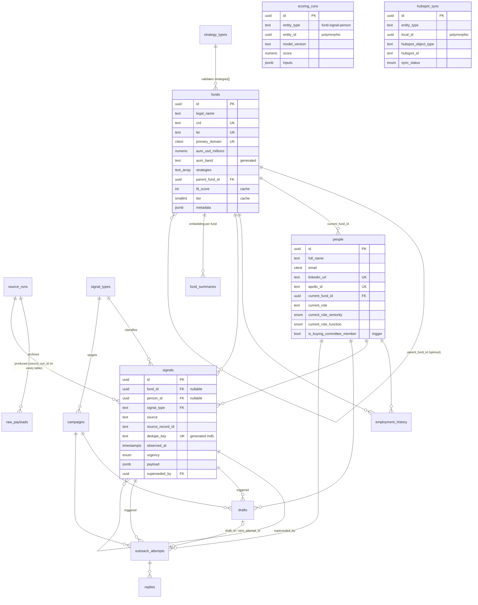

# Clarion GTM data model

The Supabase (Postgres 17) operational store for the prospecting engine. It
sits between the raw sources (edgar.tools, Apollo, web search, LinkedIn Sales
Navigator, HeyReach) and the action layer (HubSpot, Apollo sequences, HeyReach
campaigns), and it is the **source of truth** for fund entities, people,
signals, and outreach state.

## Philosophy: signals are the bus, funds are the entities, runs are the audit trail

- **Signals are the bus.** Every observable event — a Form D filing, a COO
  hire, a job post implying PMS displacement — lands in `signals` as one
  normalized row: a `signal_type` (lookup, not enum), a `source` string, the
  source's natural record id, and a `payload` jsonb with the event data.
  Downstream logic (scoring, campaign triggering) consumes signals; it never
  cares which source produced them. Idempotency is structural: `dedupe_key` is
  a generated md5 of `source:source_record_id:signal_type` with a unique
  index, so re-ingesting the same record is a no-op.
- **Funds are the entities.** `funds` and `people` are the canonical records
  everything hangs off. Identity is enforced with partial unique indexes
  (CRD, LEI, domain; LinkedIn URL, Apollo id) scoped to live rows.
  `employment_history` is append-only job history — every observed job is a
  row, closed but never overwritten — powering "champion moved" alerts.
- **Runs are the audit trail.** Every orchestration run writes a `source_runs`
  row, and every row it produces anywhere carries that `source_run_id`.
  "Where did this fund come from?" is one join. Raw API responses are archived
  append-only in `raw_payloads` (deduped by content hash), so parsers can be
  re-run against history without re-hitting APIs.

Scores follow the same append-only discipline: `scoring_runs` keeps every
recomputation with model version, inputs, and reasoning; `funds.fit_score` /
`tier` are merely caches of the latest.

## ER diagram



(`scoring_runs` and `hubspot_sync` key polymorphically on `(entity_type,
entity_id/local_id)` — no FK lines by design.)

## Table inventory

| Group | Tables |
|---|---|
| Lookups (grow by INSERT) | `signal_types`, `strategy_types` |
| Provenance | `source_runs`, `raw_payloads` |
| Identity | `funds`, `people`, `employment_history` |
| Signal layer | `signals`, `scoring_runs` |
| Outreach | `campaigns`, `drafts`, `outreach_attempts`, `replies` |
| CRM sync | `hubspot_sync` |
| Search | `fund_summaries` (+ HNSW on `drafts`/`replies`/`fund_summaries` embeddings, trigram GIN on names) |

Conventions on every table: uuid-v7 PK, `created_at` / `updated_at`
(shared trigger), `created_by`, `source_run_id`, `deleted_at` (soft delete —
**never hard delete**), `metadata jsonb` for source-specific extras. FKs are
`ON DELETE RESTRICT` except the two intentional `SET NULL`s
(`funds.parent_fund_id`, `signals.superseded_by`). RLS is enabled everywhere
with a `service_role`-only policy — defense in depth; the Python client uses
the service-role key.

## The one important function

`fn_observe_job_change(person, new_fund, new_role, observed_at, function,
seniority, source, source_run_id)` — atomically closes the person's open
`employment_history` rows, inserts the new job, updates `people.current_*`
(which re-fires the buying-committee trigger), and emits a `new_role` signal.
The signal's `source_record_id` is deterministic (`person:fund:date`), so
re-observing the same move dedupes instead of double-alerting. Call it via
`PeopleRepo.observe_job_change(...)`; never replicate the steps by hand.

## How to add a new data source — zero migrations

Adding, say, a podcast-transcript scanner:

1. **Pick a `source` string** (`podcast_scan`). It's just text on
   `signals.source` and `raw_payloads.source`. No registry, no DDL.
2. **Add signal types if the source observes new kinds of events** — a row in
   `signal_types` via `gtm/db/seed.py` + `make db.seed` (or a one-line
   `INSERT`). Existing types need nothing.
3. **In the skill**: `RunsRepo.start_run("podcast_scan")` → archive each raw
   response with `archive_payload(...)` → normalize events into
   `SignalsRepo.record_signal(SignalIn(...), source_run_id=...)` →
   `finish_run(...)`. Dedupe, provenance, and urgency defaults are handled by
   the schema.
4. **Source-specific fields** (episode URL, timestamp) go in
   `signals.payload` / `metadata` jsonb. Promote a key to a real column only
   once you need to index or join on it — that's the only case that ever
   needs a migration.

The same recipe applies to new scoring models (a new `model_version` string in
`scoring_runs`) and new strategies (a row in `strategy_types`).

## Python access layer

```
gtm/
├─ models/          # Pydantic v2 mirrors of every table (In/Out pairs)
└─ db/
   ├─ client.py     # singleton; SUPABASE_URL + SUPABASE_SERVICE_ROLE_KEY from .env
   ├─ seed.py       # signal_types vocabulary (idempotent upsert)
   ├─ repositories/ # funds, people, signals, outreach, runs — the ONLY layer
   │                # that touches the client; orchestration imports repos
   └─ tests/        # pytest integration tests (skip if no credentials)
```

Lifecycle commands live in the top-level `Makefile`: `db.migrate`, `db.seed`,
`db.reset` (local only), `db.test`, `db.types`.
